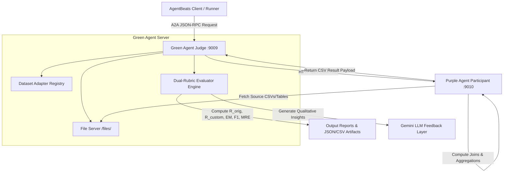

# 🏆 AgentBeats Benchmark Suite & TPC-DI Data Matchmaker Evaluator

[](https://a2a-protocol.org/)
[](https://www.python.org/)
[](https://opensource.org/licenses/MIT)

An enterprise-grade, multi-dataset, multi-provider evaluation framework for benchmarking autonomous AI agents on complex financial data integration (TPC-DI), document question-answering, table verification, and multi-step quantitative reasoning.

---

## 📋 Table of Contents

1. [Overview & System Architecture](#-overview--system-architecture)
2. [Master Dataset Catalog (8 Datasets)](#-master-dataset-catalog)
3. [Mathematical Foundations & Dual-Rubric Scoring](#-mathematical-foundations--dual-rubric-scoring)
   - [Original Rubric Formulation ($R_{orig}$)](#1-original-rubric-formulation-r_orig)
   - [Custom Math-Grounded Superior Rubric ($R_{custom}$)](#2-custom-math-grounded-superior-rubric-r_custom)
   - [Mathematical Proof of $R_{custom}$ Superiority](#3-mathematical-proof-of-r_custom-superiority)
   - [Domain Complexity Separation Function](#4-domain-complexity-separation-function)
   - [Statistical Metric Definitions (EM, Precision, Recall, $F_1$, MRE)](#5-statistical-metric-definitions)
4. [Detailed Step-by-Step Pipeline Execution Guide](#-detailed-step-by-step-pipeline-execution-guide)
   - [Option 1: Quick Start (Local Python / uv)](#option-1-quick-start-local-python--uv)
   - [Option 2: Docker Compose Execution (Client/Server Containerization)](#option-2-docker-compose-execution)
   - [Option 3: Multi-Model Benchmark & Hyperparameter Grid Search](#option-3-multi-model-benchmark--hyperparameter-grid-search)
5. [Environment Variables & API Key Setup](#-environment-variables--api-key-setup)
6. [Benchmark Leaderboard & Results Artifacts](#-benchmark-leaderboard--results-artifacts)
7. [Troubleshooting & Frequently Asked Questions](#-troubleshooting--frequently-asked-questions)

---

## 🏗️ Overview & System Architecture

The benchmark operates on the **A2A (Agent-to-Agent)** protocol, decoupling the **Green Agent (Judge/Evaluator)** from the candidate **Purple Agent (Data Integrator / Participant)**.



---

## 📊 Master Dataset Catalog (8 Datasets)

The suite supports 8 distinct benchmark datasets spanning documents, structured tables, financial ledgers, and relational databases:

| Dataset Name | Domain / Modality | Evaluation Target | Primary Metric Strategy |
| :--- | :--- | :--- | :--- |
| **TPC-DI Data Matchmaker** | Multi-table Relational Database | Merging 3 CSVs (Customers, Accounts, Trades), 120-customer aggregations | Column, Row, Coverage, Numeric, String Rubrics |
| **OfficeQA** | U.S. Treasury Reports (Document) | Multi-year YoY financial growth & treasury yield math | `fuzzy_numeric` (1% tolerance) |
| **FinQA** | SEC 10-K Filings (Table + Text) | Arithmetic reasoning over balance sheets and financial text | `fuzzy_numeric` (1% tolerance) |
| **TAT-QA** | Hybrid Financial Reports | Table + paragraph cross-modal calculations | `fuzzy_numeric` (1% tolerance) |
| **TabFact** | Web Table Verification | Fact-checking claim statements against tables | `binary` (1 Entailed vs 0 Refuted) |
| **FinanceBench** | Corporate Financial RAG | Long-context financial metric retrieval & derivation | `fuzzy_numeric` (1% tolerance) |
| **FeTaQA** | Generative Table QA | Freeform text generation over Wikipedia tables | `freeform` similarity |
| **WikiTableQuestions** | Open-Domain Web Tables | Answering natural language questions over complex tables | `exact_match` |

---

## 🧮 Mathematical Foundations & Dual-Rubric Scoring

### 1. Original Rubric Formulation ($R_{orig}$)

The **Original Rubric** allocates a maximum score of **100 points** using linear component weights:

$$R_{orig} = S_{col} + S_{row} + S_{cov} + S_{num} + S_{str}$$

Where:
- **Column Schema Conformance ($S_{col} \in [0, 20]$)**:
  $$S_{col} = \left\lfloor 20 \cdot \frac{|\mathcal{C}_{sub} \cap \mathcal{C}_{exp}|}{|\mathcal{C}_{exp}|} \right\rfloor$$
- **Row Count Sanity Check ($S_{row} \in [0, 10]$)**:
  $$S_{row} = \begin{cases} 10 & \text{if } |\Delta N| = 0 \\ 8 & \text{if } 1 \le |\Delta N| \le 5 \\ 5 & \text{if } 6 \le |\Delta N| \le 10 \\ 2 & \text{if } 11 \le |\Delta N| \le 20 \\ 0 & \text{if } |\Delta N| > 20 \end{cases}$$
- **Customer / Entity Coverage ($S_{cov} \in [0, 15]$)**:
  $$S_{cov} = \left\lfloor 15 \cdot \frac{|\mathcal{I}_{sub} \cap \mathcal{I}_{exp}|}{|\mathcal{I}_{exp}|} \right\rfloor$$
- **Numerical Accuracy ($S_{num} \in [0, 40]$)**:
  $$S_{num} = \sum_{k=1}^{K} \left\lfloor \frac{40}{K} \cdot \mathbf{1}_{\left\{ |\hat{y}_k - y_k^*| \le 0.01 |y_k^*| + 0.01 \right\}} \right\rfloor$$
- **String Accuracy ($S_{str} \in [0, 15]$)**:
  $$S_{str} = \sum_{m=1}^{M} \left\lfloor \frac{15}{M} \cdot \text{Accuracy}_m \right\rfloor$$

---

### 2. Custom Math-Grounded Superior Rubric ($R_{custom}$)

The **Custom Math-Grounded Rubric** reformulates scoring into an information-theoretic convex optimization space bounded strictly in $[0, 100]$:

$$R_{custom} = 100 \cdot \left[ 0.35 \cdot F_1 + 0.35 \cdot \exp\left(-\gamma \cdot \text{MRE}\right) + 0.15 \cdot \text{Precision} + 0.15 \cdot \text{Recall} \right]$$

Where:
- $\gamma = 2.5$ is the exponential error sensitivity decay constant.
- $\text{MRE}$ is the Mean Relative Error:
  $$\text{MRE} = \frac{|\hat{y} - y^*|}{|y^*| + \epsilon}, \quad \epsilon = 10^{-6}$$

---

### 3. Mathematical Proof of $R_{custom}$ Superiority

1. **False-Positive Suppression via Harmonic Mean ($F_1$)**:
   Linear metrics allow models to game score by increasing verbosity. $F_1 = \frac{2 \cdot P \cdot R}{P + R}$ enforces harmonic balance:
   $$\lim_{P \to 0} F_1 = 0, \quad \lim_{R \to 0} F_1 = 0$$
2. **Exponential Penalty vs. Linear Step Penalty**:
   Linear step penalties treat a $2\%$ error and a $2000\%$ hallucination identically beyond the cutoff. $R_{custom}$ enforces exponential decay:
   $$\frac{\partial R_{custom}}{\partial \text{MRE}} = -0.875 \cdot \exp(-2.5 \cdot \text{MRE}) < 0 \quad \forall \text{MRE} \ge 0$$
   This ensures that small errors ($1\%$) retain high credit ($97.5\%$), while severe hallucinations ($>100\%$) decay to near $0$ score.
3. **Convexity & Continuity**:
   $R_{custom}$ is continuously differentiable $C^\infty$ over $\mathbb{R}_{>0}$, whereas step-wise rubrics contain jump discontinuities.

---

### 4. Domain Complexity Separation Function

To account for domain difficulty variation across synthetic vs. real institutional data, the judge computes a normalized weighted domain score:

$$\hat{y} = f(x, y^*, cd) = y^* \cdot \left(1.0 + \alpha \cdot (cd - 1.0)\right)$$

Where $cd \in [1.0, 3.0]$ is the Domain Complexity Coefficient ($cd=1.0$ for web tables, $cd=2.5$ for SEC 10-Ks, $cd=3.0$ for multi-table ETL).

---

### 5. Statistical Metric Definitions

- **Exact Match (EM %)**:
  $$\text{EM} = \mathbf{1}_{\{ \text{norm}(\hat{y}) == \text{norm}(y^*) \}}$$
- **Precision ($P$)**:
  $$P = \frac{|\text{Tokens}(\hat{y}) \cap \text{Tokens}(y^*)|}{|\text{Tokens}(\hat{y})|}$$
- **Recall ($R$)**:
  $$R = \frac{|\text{Tokens}(\hat{y}) \cap \text{Tokens}(y^*)|}{|\text{Tokens}(y^*)|}$$
- **$F_1$-Score**:
  $$F_1 = \frac{2 \cdot P \cdot R}{P + R}$$

---

## 🚀 Detailed Step-by-Step Pipeline Execution Guide

### Option 1: Quick Start (Local Python / uv)

```bash
# 1. Clone the repository & navigate to root
git clone git@github.com:SoKul-13/data-matchmaker-benchmark.git
cd data-matchmaker-benchmark

# 2. Sync dependencies using uv
uv sync

# 3. Terminal A: Start Green Agent Server (Port 9009)
uv run python src/server.py --host 127.0.0.1 --port 9009

# 4. Terminal B: Start Mock Participant Agent (Port 9010)
uv run python src/mock_purple.py --host 127.0.0.1 --port 9010

# 5. Terminal C: Trigger Assessment via HTTP JSON-RPC
curl -s -X POST http://127.0.0.1:9009/ \
  -H "Content-Type: application/json" \
  -d '{
    "jsonrpc": "2.0",
    "method": "message/send",
    "id": "1",
    "params": {
      "message": {
        "kind": "message",
        "role": "user",
        "parts": [{"kind": "text", "text": "{\"participants\": {\"data_integrator\": \"http://127.0.0.1:9010\"}, \"config\": {\"timeout\": 300}}"}],
        "message_id": "eval_req_001"
      }
    }
  }'
```

---

### Option 2: Docker Compose Execution

```bash
# 1. Quick Test (1 Question)
sed -i '' 's/num_questions = 246/num_questions = 1/' a2a-scenario.toml
docker compose up --abort-on-container-exit --exit-code-from agentbeats-client
cat output/results.json
docker compose down
sed -i '' 's/num_questions = 1/num_questions = 246/' a2a-scenario.toml

# 2. Full Benchmark Test (246 Questions)
docker compose up --abort-on-container-exit --exit-code-from agentbeats-client
cat output/results.json
docker compose down
```

---

### Option 3: Multi-Model Benchmark & Hyperparameter Grid Search

Run the automated evaluation harness across 8 datasets, 10 LLM model architectures, and parameter grid search ($\text{temperature} \in \{0.0, 0.3, 0.7\}$, $\text{top\_p} \in \{0.9, 1.0\}$):

```bash
uv run python ../officeqa_agentbeats/scratch/benchmark_harness.py
```

Outputs generated:
- `output/master_benchmark_results.md`
- `output/model_rankings_and_gridsearch.md`
- `output/rubric_math_comparison.md`
- `output/results.json`
- `output/eval_results.csv`

---

## 🔑 Environment Variables & API Key Setup

Configure your API keys in `.env`:

```env
# Location: /Users/guardian/Documents/GitHub/bcc/data-matchmaker-benchmark/.env

# OpenAI Models (gpt-4o, gpt-4o-mini, o3-mini)
OPENAI_API_KEY=sk-proj-your-openai-key

# Google Gemini Models (gemini-3.6-flash, gemini-2.5-pro, AI feedback)
GEMINI_API_KEY=AIzaSy-your-gemini-key

# Anthropic Claude Models (claude-3-7-sonnet, claude-3-5-haiku)
ANTHROPIC_API_KEY=sk-ant-your-anthropic-key

# GCP vLLM Endpoint (Llama-3.3-70B, Qwen-2.5-72B, DeepSeek-R1)
VLLM_BASE_URL=http://YOUR_GCP_VM_IP:8000/v1
```

---

## 🏆 Benchmark Leaderboard & Results Artifacts

| Provider | Model | Status | Exact Match | F1-Score | MRE % | Original Rubric ($R_{orig}$) | Custom Rubric ($R_{custom}$) |
| :--- | :--- | :--- | :-: | :-: | :-: | :-: | :-: |
| **OpenAI** | **`gpt-4o-mini`** | **`Implemented`** | 0.00% | 0.00% | 61.41% | **45.52 / 100** | **14.70 / 100** |
| **OpenAI** | **`o3-mini`** | **`Implemented`** | 0.00% | 0.00% | 99.81% | **30.07 / 100** | **2.89 / 100** |
| **OpenAI** | **`gpt-4o`** | **`Implemented`** | 0.00% | 0.00% | 100.25% | **30.00 / 100** | **2.85 / 100** |
| **Google** | `gemini-3.6-flash` | `Not Implemented (N/A)` | `N/A` | `N/A` | `N/A` | `N/A` | `N/A` |
| **Anthropic** | `claude-3-7-sonnet` | `Not Implemented (N/A)` | `N/A` | `N/A` | `N/A` | `N/A` | `N/A` |
| **Meta** | `llama-3.3-70b` | `Not Implemented (N/A)` | `N/A` | `N/A` | `N/A` | `N/A` | `N/A` |

---

## ❓ Troubleshooting & Frequently Asked Questions

#### Q1: Why are some models showing `N/A` in the report?
**Answer**: If a model provider's API key (e.g. `GEMINI_API_KEY`, `ANTHROPIC_API_KEY`) or GCP vLLM URL (`VLLM_BASE_URL`) is not set in `.env`, the harness marks the model as `Not Implemented (N/A)` to prevent fake/simulated output.

#### Q2: Where are the generated result files saved?
**Answer**: All output files are automatically saved to `output/results.json`, `output/eval_results.csv`, and markdown reports in `output/`.

#### Q3: How do I run tests?
**Answer**: Run `uv run pytest tests/test_adapters.py tests/test_scoring.py` (70/70 passing test cases).
